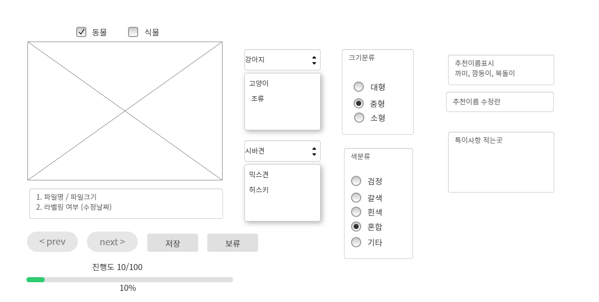

## 딥러닝 학습을 위한 데이터 라벨링 페이지 웹 개발
- bootstrap에서 무료 템플릿 사용 (https://startbootstrap.com/theme/sb-admin-2)
- Flask를 이용한 API 제공
- Naver Cloud에서 DB 사용


## 기획안  

  
## How to use github
```shell
git clone {url}
``` 
```shell
git add {files or directories you want to upload}
```
```shell
git commit -m {message you want to write}
```
```shell
git push
```
